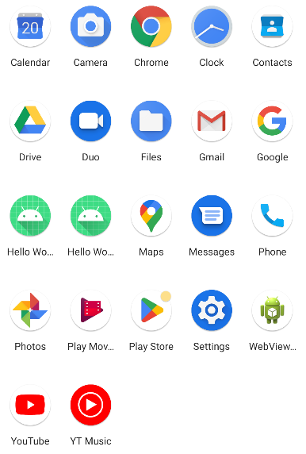

# **Lesson-6**

## **Questions**

1. **Add a new Activity class to my project, and my application keeps crashing. What did I do wrong?**

    You must add the Activities you create in the `Manifest.xml`.

2. **True or False: Every Android application needs an Android manifest file.**

    <span style="color:green">**True**</span>

3. **True or False: The android:versionCode numbers must correspond with the application android:versionName.**

    <span style="color:red">**False**</span>

4. **What is the permission for using the camera?**

    A. android.permission.USE_CAMERA

    <span style="color:green">**B. android.permission.CAMERA**</span>

    C. android.permission.hardware.CAMERA

5. **True or False: When installing an application, the user is shown the permissions requested in the Android manifest file.**

    <span style="color:green">**True**</span>

---

## **Exercise**

1. **Create a new activity with a new layout (fell free to design the layout). Declare this new activity as the main and launcher activity of your “Hello World” project.**

    To declare this Activity as main, it will be necessary to write 2 important tags in the `AndroidManifest.xml`:

    ```xml
    <intent-filter>
        <action android:name="android.intent.action.MAIN" />
        <category android:name="android.intent.category.LAUNCHER" />
    </intent-filter>
    ```

    The complete code of the activity would look like this: (The name of my Activity is `MainActivity`).

    ```xml
    <activity
        android:name=".MainActivity"
        android:exported="true">
        <intent-filter>
            <action android:name="android.intent.action.MAIN" />
            <category android:name="android.intent.category.LAUNCHER" />
        </intent-filter>
        <meta-data
            android:name="android.app.lib_name"
            android:value="" />
    </activity>
    ```

2. **Add the Camera permission of you “Hello World" project.**

    To add a permission it will be necessary to enter the following tag (before the `<application>` tag):

    ```xml
    <uses-permission android:name="android.permission.CAMERA"/>
    ```

3. **Review the complete list of available permissions for Android applications in the Android SDK documentation. You can do this with your local copy of the documentation, or online at the Android Developer website http://goo.gl/II3Uv.**

4. **Add a second permission (any will do, this is just for practice) to the application.**

    ```xml
    <uses-permission android:name="android.permission.CAMERA"/>
    <uses-permission android:name="WRITE_EXTERNAL_STORAGE"/>
    ```

5. **You have added a new Activity class in the first exercise and registered it within the Android manifest file. Take this exercise a step further and put more than one activity have to be a launcher activity. Each one with the launcher category appears in the application list with an icon. This is not typical, so you might want to move the intent filter rather than copy it. Save your changes and run your application. The label activity and the launch icon have to different from one activity to another.**

    To do this, I edited the `AndroidManifest.xml` file like this:

    ```xml
    <activity
        android:name=".NewMainActivity"
        android:exported="true">
        <intent-filter>
            <action android:name="android.intent.action.MAIN" />
            <category android:name="android.intent.category.LAUNCHER" />
        </intent-filter>
        <meta-data
            android:name="android.app.lib_name"
            android:value="" />
    </activity>
    <activity
        android:name=".MainActivity"
        android:exported="true">
        <intent-filter>
            <action android:name="android.intent.action.MAIN" />
            <category android:name="android.intent.category.LAUNCHER" />
        </intent-filter>
        <meta-data
            android:name="android.app.lib_name"
            android:value="" />
    </activity>
    ```

    When you run the app, 2 shortcuts will be created on the device with the same name (App Name). Depending on which access we execute, we initialize one Activity or another.

    

---

## **Photo Saver**

A program with which to take photos, display them through an `ImageView` and save them in the gallery.

<details>

**<summary>Application Images</summary>**


</details>

### **Code**

<ul>

#### <li>**Java files**

<ul>

<li>

<details>

**<summary>`MainActivity.java`</summary>**

```java
package com.example.photosaver;

import androidx.activity.result.ActivityResult;
import androidx.activity.result.ActivityResultCallback;
import androidx.activity.result.ActivityResultLauncher;
import androidx.activity.result.contract.ActivityResultContracts;
import androidx.annotation.NonNull;
import androidx.appcompat.app.AppCompatActivity;
import androidx.core.app.ActivityCompat;
import androidx.core.content.ContextCompat;

import android.Manifest;
import android.content.ContentValues;
import android.content.Intent;
import android.content.pm.PackageManager;
import android.net.Uri;
import android.os.Bundle;
import android.provider.MediaStore;
import android.widget.Button;
import android.widget.ImageView;
import android.widget.Toast;

public class MainActivity extends AppCompatActivity {


    Button buttonMakePhoto;
    ImageView imageViewPhoto;
    Uri camUri;

    private static final int REQUEST_CODE_TAKE_PHOTO = 1;


    @Override
    protected void onCreate(Bundle savedInstanceState) {
        super.onCreate(savedInstanceState);
        setContentView(R.layout.activity_main);


        this.imageViewPhoto = findViewById(R.id.imageViewPhoto);
        this.buttonMakePhoto = findViewById(R.id.buttonMakePhoto);


        this.buttonMakePhoto.setOnClickListener(view -> {
            if (ContextCompat.checkSelfPermission(this, Manifest.permission.CAMERA) == PackageManager.PERMISSION_GRANTED) {
                this.pickCamera();

            } else {
                ActivityCompat.requestPermissions(this, new String[]{Manifest.permission.CAMERA}, REQUEST_CODE_TAKE_PHOTO);
            }
        });


    }


    // In case the user denies the permission.
    @Override
    public void onRequestPermissionsResult(int requestCode, @NonNull String[] permissions, @NonNull int[] grantResults) {

        if (requestCode == REQUEST_CODE_TAKE_PHOTO) {
            if (grantResults.length > 0 && grantResults[0] == PackageManager.PERMISSION_GRANTED) {

                this.pickCamera();

            } else {
                Toast.makeText(this, "Denied the permission for camera", Toast.LENGTH_SHORT).show();
            }
        }

        super.onRequestPermissionsResult(requestCode, permissions, grantResults);
    }


    ////////////////////////////////////////////////////////////////////////////////////////////////
    // CAMERA
    ////////////////////////////////////////////////////////////////////////////////////////////////

    ActivityResultLauncher<Intent> startCamera = registerForActivityResult(
            new ActivityResultContracts.StartActivityForResult(),
            new ActivityResultCallback<ActivityResult>() {
                @Override
                public void onActivityResult(ActivityResult result) {
                    if (result.getResultCode() == RESULT_OK) {

                        imageViewPhoto.setImageURI(camUri);
                    }
                }
            }
    );

    public void pickCamera() {
        this.camUri = getContentResolver().insert(MediaStore.Images.Media.EXTERNAL_CONTENT_URI, new ContentValues());

        Intent cameraIntent = new Intent(MediaStore.ACTION_IMAGE_CAPTURE);
        cameraIntent.putExtra(MediaStore.EXTRA_OUTPUT, this.camUri);

        startCamera.launch(cameraIntent);
    }


}
```

</details>

</li>

</ul>

</li>

### <li>**XML files**

<ul>

<li>

<details>

**<summary>`AndroidManifest.xml`</summary>**

```xml
<?xml version="1.0" encoding="utf-8"?>
<manifest xmlns:android="http://schemas.android.com/apk/res/android"
    xmlns:tools="http://schemas.android.com/tools">

    <uses-permission android:name="android.permission.CAMERA" />
    <uses-permission android:name="android.permission.READ_EXTERNAL_STORAGE" />
    <uses-permission android:name="android.permission.WRITE_EXTERNAL_STORAGE" />


    <application
        android:allowBackup="true"
        android:dataExtractionRules="@xml/data_extraction_rules"
        android:fullBackupContent="@xml/backup_rules"
        android:icon="@mipmap/ic_launcher"
        android:label="@string/app_name"
        android:roundIcon="@mipmap/ic_launcher_round"
        android:supportsRtl="true"
        android:theme="@style/Theme.PhotoSaver"
        tools:targetApi="31">
        <activity
            android:name=".MainActivity"
            android:exported="true">
            <intent-filter>
                <action android:name="android.intent.action.MAIN" />

                <category android:name="android.intent.category.LAUNCHER" />
            </intent-filter>

            <meta-data
                android:name="android.app.lib_name"
                android:value="" />
        </activity>
    </application>

</manifest>
```
</details>

</li>

#### <li>**`layout`**

<ul>

<li>

<details>

**<summary>`activity_main.xml`</summary>**

```xml
<?xml version="1.0" encoding="utf-8"?>
<LinearLayout xmlns:android="http://schemas.android.com/apk/res/android"
    android:layout_width="match_parent"
    android:layout_height="match_parent"
    android:orientation="vertical">


    <Button
        android:id="@+id/buttonMakePhoto"
        android:layout_width="match_parent"
        android:layout_height="wrap_content"
        android:text="Make Photo" />

    <ImageView
        android:id="@+id/imageViewPhoto"
        android:layout_width="match_parent"
        android:layout_height="match_parent"
        android:contentDescription="Image from Camera" />


</LinearLayout>
```

</details>

</li>

</ul>

</li>

</li>


</ul>

</ul>
